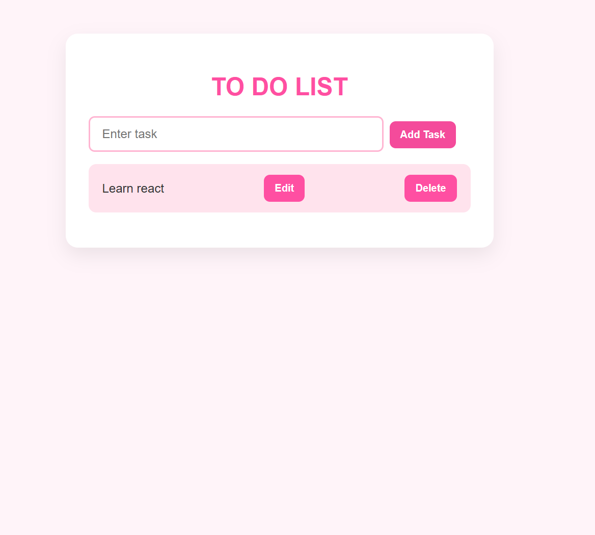

`React + TypeScript Todo List App `

This is a simple and functional Todo List app built using `React`, `TypeScript`, and  `Vite`.

`Objective`

Built as part of `A2SV Task 4`to practice:
- React + TypeScript development
- Component structure and props
- React Hooks (`useRef`, `useState`)
- CSS styling
-
`Features`

- Add new tasks
- Edit existing tasks
- Delete tasks
- Built with modular components (`AddToDo`, `NewTask`, `Header`)
- Styled with basic CSS

`Technologies`

- React
- TypeScript
- Vite
- CSS

